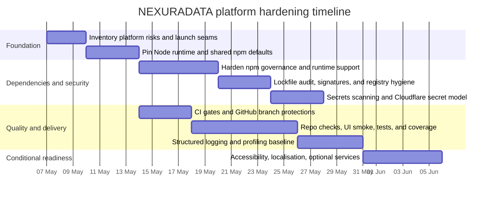

# Platform Hardening Timeline

This adapts the original enterprise hardening plan to NEXURADATA's actual stack: Node.js, npm, Cloudflare Pages, Pages Functions, GitHub Actions, Neon, Stripe and Resend.

## Phase Checklist

| Phase | Done when |
| --- | --- |
| Discovery | We can answer what is running and shipping: public pages, Functions, operations console, CI/deploy workflows, secrets and release output. |
| Foundation | Node, npm scripts, CI and fresh clones use the same runtime and build defaults. |
| Dependencies | `package-lock.json`, `.npmrc`, Dependabot, audit, signatures and Dependency Review keep packages reproducible and reviewable. |
| Review gates | PRs require machine checks and human review before protected branches receive code. |
| Quality | `.editorconfig`, `npm run check`, `npm run ui:smoke`, Vitest and coverage make quality visible. |
| Security | Source has placeholders only, secrets live in GitHub/Cloudflare/provider storage, and scans cover local source plus history. |
| Operations | API and ops requests produce safe structured logs with request IDs, correlation IDs and trace context. |
| Conditional readiness | Containers are added only for future services that deploy as containers; accessibility/localisation checks stay active for public UI. |

## Translation Notes

- .NET `Directory.Build.*` and `global.json` map to npm scripts, `.editorconfig`, `.node-version` and CI `setup-node`.
- NuGet central management and source mapping map to `package-lock.json`, `.npmrc`, Dependabot, Dependency Review, `npm audit` and `npm audit signatures`.
- Runtime retargeting maps to the Node 22 pin and controlled major-version upgrades.
- Vault-backed secrets map to Cloudflare Pages secrets plus GitHub environment secrets for deployment.

Provider settings still matter: enable GitHub branch protection, GitHub secret scanning/push protection, production environment approval, least-privilege Cloudflare deployment tokens and central Cloudflare log export.
